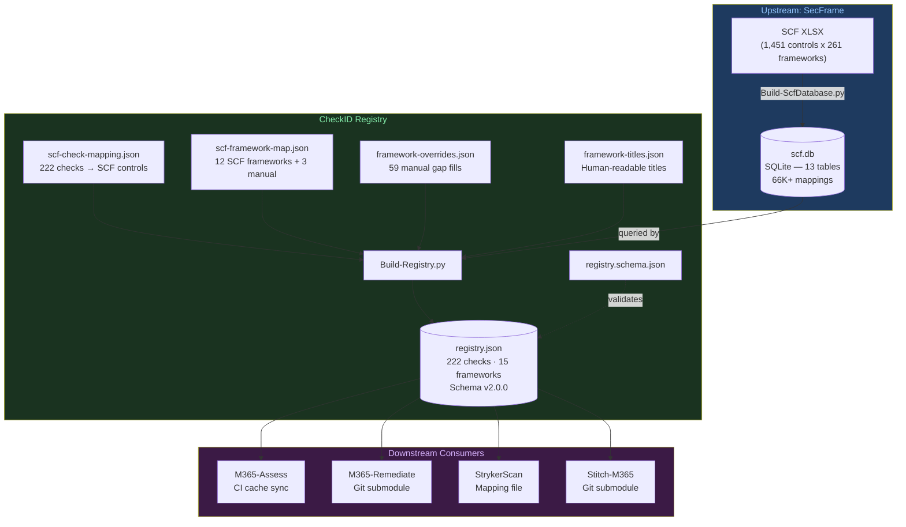
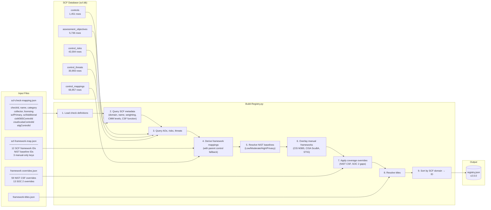
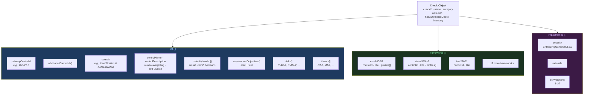
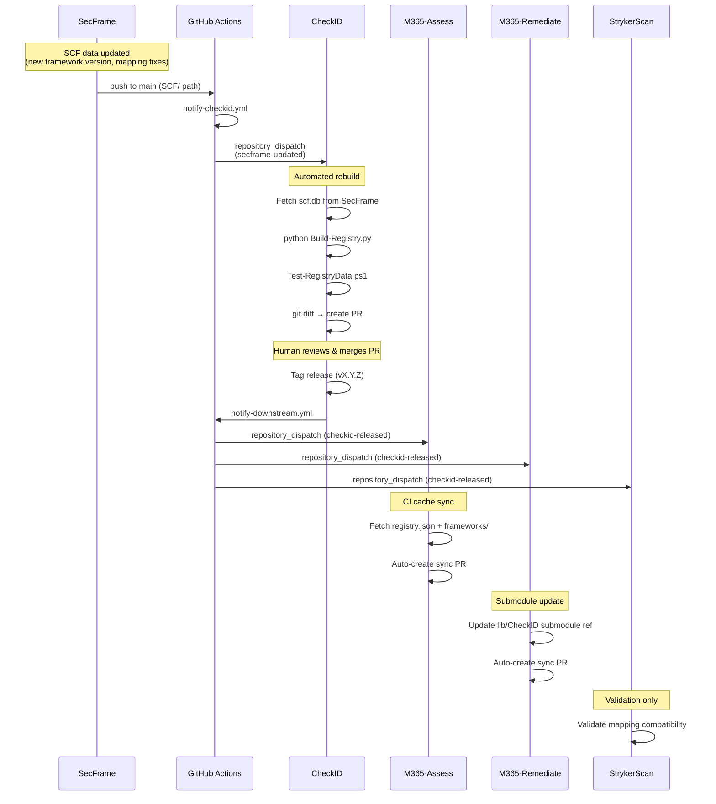
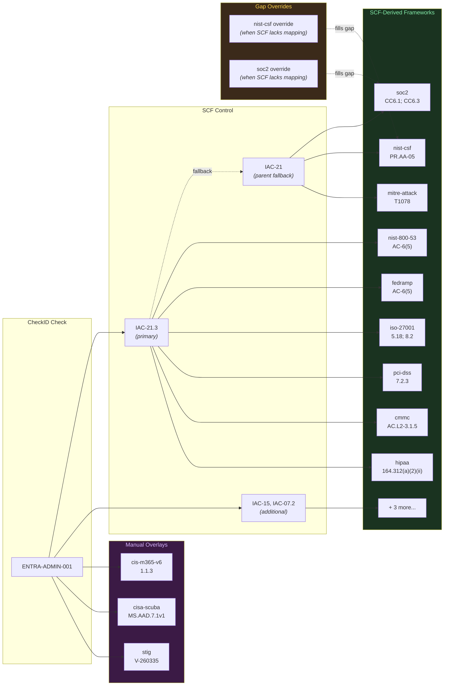
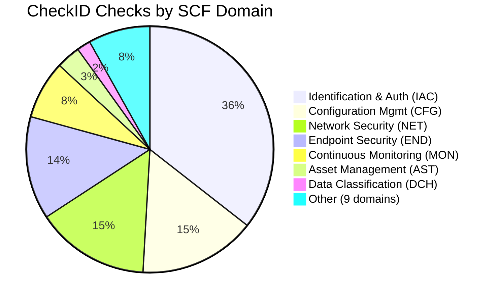
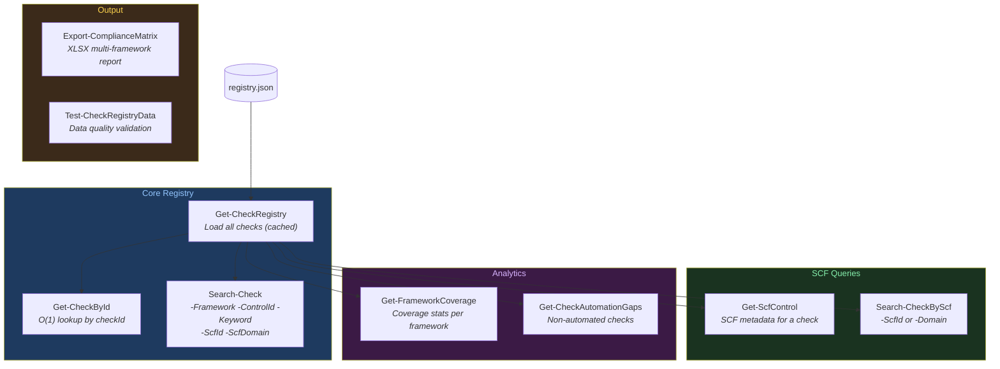

# CheckID Architecture

Visual documentation of CheckID's core functionality, data pipeline, and integrations.

## System Context

How CheckID fits between its upstream data source (SecFrame/SCF) and downstream consumers.

## Registry Build Pipeline

Detailed data flow showing how `registry.json` is assembled from multiple sources.

## Check Object Structure

Anatomy of a single check in `registry.json`.

## CI Cascade

Automated pipeline from upstream data changes through to downstream consumer sync.

## Framework Derivation

How framework mappings flow from a single SCF control to 15+ compliance frameworks.

## SCF Domain Distribution

How CheckID's 222 checks map across SCF domains.

## PowerShell Module API

Public cmdlets exposed by `CheckID.psm1` (v2.0.0).

